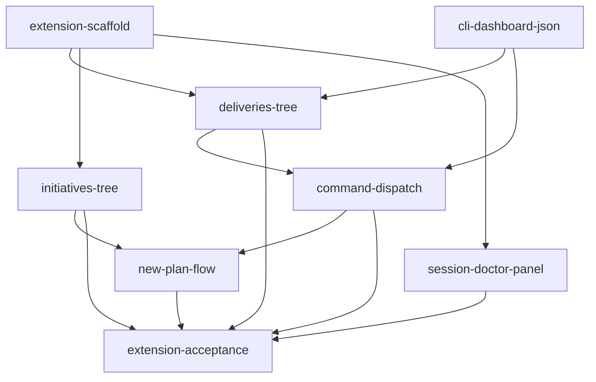

```yaml
initiative: agento-extension
created: 2026-09-18
last-updated: 2026-09-18
```

# Agento VS Code extension: a graphical control surface over the CLI

## Goal

A VSIX under `extension/` that renders what the Agento CLI already knows — every
delivery with its lifecycle, PR and companion-PR state, owning worktree and initiative;
every initiative with its ready, blocked, in-flight and complete members — as live tree
views, a session/doctor panel and a status bar item, and that dispatches the canonical
`/agento …` commands into Copilot Chat in the window the session record says they
belong to. The agent plugin remains the execution engine; the extension is a dashboard,
launcher and window router only, and never re-derives lifecycle, ownership, allowed
commands or the next transition.

## Decisions

- **Q1: First wave / what must ship first.** Should wave 1 be the read-only foundation
  (extension scaffold + bundled CLI copy + lockstep-version test + Deliveries tree
  rendering `status`/`session` JSON), with all action dispatch deferred to wave 2? Or
  should the very first shippable member already include at least one clickable action?
  A: "We won't ship until the entire initiative is done"
- **Q2: Additive CLI JSON.** Is it acceptable for the initiative to include a member
  feature that adds CLI fields the UI needs, or should the extension consume only what
  the CLI emits today? A: "Yes, additive JSON is good"
- **Q3: Target size of a member feature.** Roughly "one Builder session, ≤ ~10 roadmap
  steps, one PR" (6–8 members), or larger members (3–4)? A: "Whatever strategy is most
  liktely to be 100% successful"
- **Q4: Extension tests in CI.** Should the initiative include CI wiring (GitHub Actions
  job + Xvfb) for `@vscode/test-electron`, or is running extension tests locally enough?
  A: "running extension tests locally enough for this initiative (CI is out of scope)"
- **Q5: Bundling approach.** Is a plain `tsc` build plus a copy step (no esbuild/webpack,
  no runtime deps) acceptable for the VSIX, with `typescript`, `@vscode/vsce`,
  `@vscode/test-electron`, `@types/vscode` as the only dev dependencies? A: "Whatever is
  most likely to be succesfful"

Interpretation applied below: Q1 means no VSIX release or version bump until every
member is complete — members still land individually through their own PRs, each
leaving `main` green and the extension buildable. Q3 and Q5 favour many small,
low-risk members with a plain `tsc` build; the first member is a pure CLI change that
is verifiable with the existing node:test suite before any extension code exists.

## Research

Skills consulted: none — no matching domain (the repository has no `.agents/skills/`
directory and no skills table in AGENTS.md).

- **CLI surface the extension renders.** `scripts/agento.mjs` header (L1–22) lists the
  subcommands; every call prints one JSON document, exit 0 usable / 1 usage / 3
  resolution failure. `session [--pr]` (L1140+) yields `role`, `hosted`, `worktree`,
  `worktrees[]` (each tagged `repo: "product" | "companion"`, `worktrees[0]` is always
  the product primary), `companion` (`{ path, branch, detached, dirty, ahead, behind,
  registered }` or `null` in the primary), `workspace` (`{ path, exists }`), `delivery`,
  `pr`, `companionPr`, `lifecycle`, `allowed[]`, `elsewhere[]` (`{ command, window }`),
  `warnings[]`. `next [<slug>]` returns `status ∈ ok | none | ambiguous | blocked |
  unsupported | missing`, `next { command, args, invocation, window: here | primary |
  secondary, then, reason }`, `candidates[]`, `dispatch { prompt, agent }`
  (`scripts/session-state.mjs` L339–492). `initiative` with no slug lists `items[]`
  with `total`, `complete`, `inFlight`, `ready`, `done`, `valid` (`agento.mjs`
  L1107–1125); with a slug adds per-feature `state`, `ready`, `blockedBy`, `wave`,
  `next`, `errors`, `anomalies`. `doctor [--for]` returns `checks[] { id, status,
  detail, fallback }` (seven checks). `paths <kind> <id>` returns `worktree`, `branch`,
  `companion { worktreesDir, worktree, branch } | null`, `workspace |
  null` (L1095–1103).
- **Gap: `status` has no lifecycle, owner or PR.** `case "status"` (`agento.mjs`
  L997–1008) sorts by roadmap `status` in the order `in-progress, paused, in-review,
  planned, complete` and emits `items[]` from `describeContent()` (L339–360: `type`,
  `slug`, `dir`, `roadmap`, `plan`, `review`, `reviewVerdict`, `status`, `branch`,
  `nextStep`, `githubIssue`, `artifactPr`, `initiative`, step counts) plus `duplicates`
  and `resumable[]`. The brief's Deliveries tree needs `lifecycle`, the owning
  worktree, `pr`/`companionPr` and the pair's `.code-workspace` per node, "grouped by
  lifecycle in the CLI's order" — the order is `LIFECYCLES` in `session-state.mjs`
  L223 (`no-delivery, planned, building, paused, in-review, approved, shipped,
  post-ship-pending`), and `deriveLifecycle`, `findOwner`, `describeCompanion`
  (`agento.mjs` L275–290) and `describeWorkspace` (L296–300) already compute the
  pieces for `session` and `ship-preflight`. Since the extension may not re-derive any
  of it, an additive `status --pr` shape is the first member.
- **Gap: `next` names a window kind, not a path.** `transition()` (`session-state.mjs`
  L342–344) carries `window: here | primary | secondary`; resolving `secondary` to the
  managed `worktrees[]` entry on `delivery.branch` and its `.code-workspace` is left
  to the caller. An additive `target { path, workspace }` on `next` keeps the router
  free of ownership logic.
- **Versions and lockstep.** `package.json` L3 and `.claude-plugin/plugin.json` L4 are
  both `0.5.2`; `tests/customizations.test.mjs` L471 already asserts they match, so
  the extension's `package.json` joins that assertion. `package.json` `scripts.test`
  is `node --test 'scripts/**/*.test.mjs' 'tests/**/*.test.mjs'`, `engines.node >=20`,
  no dependencies; `.github/workflows/ci.yml` exists and runs the node tests (CI
  wiring for electron tests is out of scope per Q4, so the extension's node:test
  suites must be runnable by that same glob or excluded deliberately).
- **Window creation.** `commands/start-session.md` shared precondition 4: in companion
  mode the pair opens as `<worktrees.dir>/<kind>-<id>.code-workspace` (`folders:
  [product, companion]`, `settings: {}`), product-only sessions as `code --new-window
  <path>`. The extension opens the same file (`vscode.openFolder` on the workspace
  URI with `forceNewWindow`) rather than the two folders separately.
- **Cross-window dispatch has no public API.** VS Code exposes no way to send a
  command to another window. Both `next` and `elsewhere[]` already encode the
  hand-off: from the primary, `next` for a delivery owned by a secondary is
  `start-session <type>/<slug> --resume` with `then: "/agento continue <slug>"`
  (`session-state.mjs` L404–415), and every `elsewhere[]` row names the window. The
  extension therefore opens the target window and lets *its own instance* there
  submit the command on activation, via a pending-dispatch record in the extension's
  `globalState` (shared across windows of one VS Code installation) keyed by the
  target workspace path — never by reading chat output.
- **Chat submission.** `workbench.action.chat.open` accepts `{ query, mode:
  "agent", isPartialQuery? }`; submitting the canonical text keeps the receipt,
  window check and idempotency rows (`delivery-policy.instructions.md` §9, §11) in
  the agent's hands, so the extension needs no command-specific logic.
- **No prior art in the repo.** No `extension/` directory, no TypeScript, no
  `node_modules`; `docs/architecture.md` and `docs/commands.md` are the places a new
  surface is documented; `CHANGELOG.md` is maintained per release.

## Features

### cli-dashboard-json

- Summary: Additive JSON on `agento.mjs status` and `next` so a renderer needs no
  derivation: `status [--pr]` gains per-item `lifecycle`, `owner`, `workspace`,
  `companion` (dirty/ahead/behind), `pr`, `companionPr`, plus a top-level
  `lifecycles[]` order; `next` gains `target { path, workspace }` for `primary` and
  `secondary` windows.
- Brief: "All state comes from the Agento CLI … The extension never re-derives
  lifecycle, ownership, allowed commands, or next transition; it renders the JSON."
  and "Deliveries tree: one node per roadmap with type, slug, lifecycle, ticks/total,
  status, PR and companion PR state, owning worktree, initiative; grouped by lifecycle
  in the CLI's order." and "any CLI change is additive JSON."
- Requires: none
- Recommended after: none
- Wave: 1
- Size: M
- Independence: Pure CLI change covered by `scripts/agento.test.mjs` and
  `session-state.test.mjs`; existing fields and exit codes unchanged, so prompts
  (`/agento delivery-status`, `/agento ship`) keep working and may adopt the new
  fields immediately. Documented in `docs/commands.md`.

### extension-scaffold

- Summary: The `extension/` package: `package.json` (view container "Agento", no
  runtime deps, version in lockstep), `tsconfig`, plain `tsc` build, a build step
  that copies the four CLI modules into `extension/cli/`, a `CliClient` that spawns
  `node <bundled agento.mjs> <args> --root <folder>` and parses JSON, a debounced
  refresh scheduler fed by file-system watchers (`**/roadmap.md`, `**/review.md`,
  `.git/refs/**`, `.git/HEAD` in the product and companion checkouts, ≥ 3 s
  debounce, no faster polling), `@vscode/vsce` packaging, an activation test with
  `@vscode/test-electron`, `tests/extension-bundle.test.mjs` (bundled copy ≡
  `scripts/`) and the three-way version assertion; AGENTS.md gains the build, test
  and package commands.
- Brief: "a VS Code extension (TypeScript, public vscode API, packaged as a VSIX)
  living in this repository under extension/ … The extension bundles its own copy of
  scripts/agento.mjs, agento-config.mjs, session-state.mjs, and
  delivery-roadmap-resolver.mjs at build time; a test in tests/ fails when the
  bundled copy diverges from scripts/. Versions in extension/package.json,
  package.json, and .claude-plugin/plugin.json stay in lockstep, enforced by a test.
  … Refresh from file-system and git events … no background polling faster than a
  few seconds. … Node >= 20, no runtime dependencies beyond the vscode API; unit
  tests with node:test for the pure parts, extension tests with @vscode/test-electron
  for activation … AGENTS.md gains the extension's build, test, and package
  commands."
- Requires: none
- Recommended after: cli-dashboard-json
- Wave: 1
- Size: M
- Independence: Ships an installable VSIX whose only visible surface is the empty
  "Agento" view container and an output channel; the bundle-divergence and version
  tests protect `main` from the first commit, and the existing test and shellcheck
  commands stay green.

### deliveries-tree

- Summary: The Deliveries tree view: one node per roadmap from `status --pr`, grouped
  by `lifecycle` in the CLI's `lifecycles[]` order, showing type, slug, ticks/total,
  roadmap status, PR and companion PR state, owning worktree and initiative;
  click opens `roadmap.md`; refreshes through the scaffold's scheduler; rendering
  test with `@vscode/test-electron` against fixture repositories in both layouts.
- Brief: "Deliveries tree: one node per roadmap with type, slug, lifecycle,
  ticks/total, status, PR and companion PR state, owning worktree, initiative; grouped
  by lifecycle in the CLI's order." and "Companion mode … show companionPr beside pr."
- Requires: cli-dashboard-json, extension-scaffold
- Recommended after: none
- Wave: 2
- Size: M
- Independence: A read-only view with no actions; useful on its own as the live
  replacement for reading `/agento delivery-status` output.

### initiatives-tree

- Summary: The Initiatives tree view from `initiative` (list) and `initiative <slug>`
  (detail): per initiative complete/total, in-flight, ready members with `blockedBy`,
  the CLI's `next`, `done` flag and `anomalies`; click opens `breakdown.md`; rendering
  test with `@vscode/test-electron`.
- Brief: "Initiatives tree: per initiative complete/total, in-flight, ready members
  with blockedBy, the CLI's next, done flag, anomalies."
- Requires: extension-scaffold
- Recommended after: deliveries-tree
- Wave: 2
- Size: S
- Independence: Read-only and driven entirely by fields the CLI emits today; shares
  the scaffold's client and scheduler and touches no other view.

### session-doctor-panel

- Summary: The Session & Doctor view for the current window — role, worktree path,
  branch, lifecycle, `warnings[]`, in companion mode the half's dirty/ahead/behind and
  `workspace` — plus every `doctor` check with status, detail and fallback shown
  verbatim (no repair actions), and a status bar item summarising in-flight
  deliveries (`status` `resumable[]` count) and the window's role; rendering test with
  `@vscode/test-electron`.
- Brief: "Session and doctor panel: role, worktree, branch, lifecycle, warnings, each
  doctor check with status and fallback." and "Status bar item summarising in-flight
  deliveries and the current window's role." and "doctor output is shown as-is with
  fallbacks, the extension never repairs the environment."
- Requires: extension-scaffold
- Recommended after: deliveries-tree
- Wave: 2
- Size: S
- Independence: Read-only, single-window; consumes `session --pr`, `doctor` and
  `status` as they exist today.

### command-dispatch

- Summary: The launcher and window router: per-node and per-window actions built
  from exactly the record's `allowed[]` and `elsewhere[]`, each labelled with its
  window; a dispatcher that submits the canonical `/agento <name> …` text into
  Copilot Chat in agent mode (`workbench.action.chat.open`) in this window, or opens
  the target window (primary folder, or the owning secondary's folder /
  `.code-workspace` from `next.target`) and hands over via a pending-dispatch record
  the extension instance there submits on activation, preferring `/agento continue
  <slug>` cross-window; `/agento ship` is offered only when the record says the
  window is the primary; a "focus that window" affordance for a chat run elsewhere.
  Covers start-session (plan or build), new-feature, new-issue, build, review, ap,
  ship, close-session and continue. node:test for the pure action-list and
  routing functions; electron test for in-window dispatch.
- Brief: "Per-node actions from allowed[]/elsewhere[]: start-session (plan or build),
  new-feature, new-issue, build, review, ap, ship, close-session, continue; each
  labelled with the window it runs in." and "Commands are dispatched by submitting
  the canonical /agento <name> text into Copilot Chat in agent mode
  (workbench.action.chat.open), in the window next.window names … Cross-window
  dispatch prefers /agento continue <slug> … the UI never runs /agento ship anywhere
  but the primary and never marks PRs ready or merges itself." and "open pairs via
  the .code-workspace file."
- Requires: cli-dashboard-json, deliveries-tree
- Recommended after: session-doctor-panel
- Wave: 3
- Size: L
- Independence: Attaches actions to existing tree nodes and the session view; the
  extension remains fully usable read-only if dispatch is disabled, and the CLI's
  own window check (§11) rejects any mis-routed command, so a routing bug is loud,
  not destructive.

### new-plan-flow

- Summary: The "New plan" entry point: a QuickInput form (feature or issue, one-line
  description) that dispatches `/agento start-session` in the primary, watches for
  the new managed worktree (`session` `worktrees[]` / the pair's `.code-workspace`)
  to appear, opens that window and hands over `/agento new-feature <description>` or
  `/agento new-issue <description>` through the dispatcher's pending-dispatch
  record; the same mechanism plans a ready initiative member from the Initiatives
  tree (`/agento new-feature initiative:<i>/<f>`).
- Brief: "New plan flow: a form for a feature or issue description that runs /agento
  start-session in the primary, opens the new window, and submits /agento new-feature
  or /agento new-issue there."
- Requires: command-dispatch, initiatives-tree
- Recommended after: none
- Wave: 4
- Size: M
- Independence: One command and one form on top of the dispatcher; if the hand-over
  window never appears the flow reports the `start-session` result and the user
  continues with the tree's actions.

### extension-acceptance

- Summary: End-to-end acceptance and release readiness: fixture repositories for the
  in-repo and companion layouts under `tests/fixtures/extension/`, an
  `@vscode/test-electron` suite that drives both trees, the panel and in-window
  dispatch against them, `docs/extension.md` (install the plugin + VSIX, what each
  view shows, how routing works, what is out of scope), README and
  `docs/architecture.md` sections, a `CHANGELOG.md` entry, and the lockstep version
  bump that makes the first VSIX releasable alongside the plugin.
- Brief: "released alongside the agent plugin … Definition of done: a user installs
  the plugin and the VSIX, opens a repository initialised with /agento agento-init,
  sees deliveries and initiatives with correct lifecycle and PR state in both in-repo
  and companion layouts, and can create a plan, start a build, run autopilot, ship,
  and close a session from the UI with every command landing in the window the
  CLI's session record says it belongs to."
- Requires: deliveries-tree, initiatives-tree, session-doctor-panel, command-dispatch, new-plan-flow
- Recommended after: none
- Wave: 5
- Size: M
- Independence: Tests and documentation only; it is the gate the user asked for in
  Q1 ("we won't ship until the entire initiative is done") and produces the
  releasable VSIX without changing any view's behaviour.

## Recommended order

- **Wave 1 — data and skeleton:** `cli-dashboard-json`, then `extension-scaffold`.
  The CLI change is the safest possible first step (node:test only, no new toolchain)
  and lets every later member render JSON verbatim; the scaffold puts the bundle and
  version guards in place before any view code exists. The two are independent and
  may be planned concurrently.
- **Wave 2 — read-only views:** `deliveries-tree`, `initiatives-tree`,
  `session-doctor-panel`. All three are independent once the scaffold is complete
  and can run concurrently in separate sessions; the deliveries tree first because
  the dispatcher attaches to its nodes.
- **Wave 3 — actions:** `command-dispatch`. Largest and riskiest member (cross-window
  hand-over), isolated so every other member stays small and verifiable.
- **Wave 4 — guided flow:** `new-plan-flow` on top of the dispatcher and the
  initiatives tree.
- **Wave 5 — acceptance and release:** `extension-acceptance`, the definition-of-done
  gate; the version bump and first VSIX happen here, per Q1.



## Risks

- **Cross-window dispatch has no public API.** Mitigation: the design never sends
  anything to another window; it opens the window and lets the extension instance
  there submit a pending dispatch from `globalState` on activation. `/agento continue
  <slug>` is preferred so the CLI, not the UI, picks the concrete command, and the
  CLI's window check rejects a mis-routed command loudly. If `globalState` proves
  unreliable across windows, the fallback is a file under the target worktree's
  `.git/` directory (never committed), decided in `command-dispatch` planning.
- **`workbench.action.chat.open` argument shape may change between VS Code
  releases.** Mitigation: pin `engines.vscode` to the version verified during
  `command-dispatch`, keep the call in one module with an electron test, and fall
  back to opening chat with the text pre-filled (`isPartialQuery`) so the user presses
  Enter.
- **`@vscode/test-electron` needs a VS Code download and a display.** Mitigation: CI
  is out of scope (Q4); electron tests are a separate `npm` script in `extension/`
  and are excluded from the repo-wide `node --test` glob so `.github/workflows/ci.yml`
  stays green; the Builder runs them locally with `xvfb-run` when headless.
- **Bundled CLI drift.** Mitigation: `tests/extension-bundle.test.mjs` byte-compares
  `extension/cli/*.mjs` with `scripts/*.mjs` and is part of the default test command
  from the scaffold onwards; the copy step is the only writer of `extension/cli/`.
- **`status --pr` cost.** One `gh pr view` per roadmap can be slow; mitigation:
  `--pr` stays opt-in, the tree renders without PR state first and refreshes when
  the `--pr` call returns, and the scheduler debounces at ≥ 3 s.
- **Companion-mode fixtures.** Two git checkouts plus worktrees per fixture are
  fiddly; mitigation: fixtures are generated by a script in `tests/fixtures/extension/`
  from the same helpers `scripts/agento.test.mjs` already uses for temporary repos.
- **Scope creep into agent semantics.** Mitigation: every member's plan restates that
  the extension emits only canonical command text and reads only CLI JSON; any
  needed CLI field is an additive change in `cli-dashboard-json` or a follow-up, never
  UI-side derivation.

## Out of scope

- Cancelling a chat request running in another window; the UI focuses that window and
  points at the stop button, and resume is `/agento continue`.
- Reading chat output or receipts; progress is only what `roadmap.md` and git show.
- Replacing or wrapping the agents, prompts, hooks or CLI semantics; any CLI change is
  additive JSON.
- A standalone web UI, a fork of VS Code, Marketplace publishing automation (packaging
  a VSIX is enough), and CI wiring for `@vscode/test-electron` (Q4).
- Releasing or version-bumping before every member is complete (Q1).

## Definition of done

Every member is `status: complete`, `agento.mjs initiative agento-extension` reports
`done: true`, and: a user installs the plugin and the VSIX built by
`extension/`'s package command, opens a repository initialised with
`/agento agento-init`, sees deliveries and initiatives with correct lifecycle and PR
state in both the in-repo and companion layouts, and can create a plan, start a
build, run autopilot, ship and close a session from the UI with every command landing
in the window the CLI's session record names; `extension/cli/` is byte-identical to
`scripts/`, the three versions match, and the repository's existing test and
shellcheck commands stay green.
