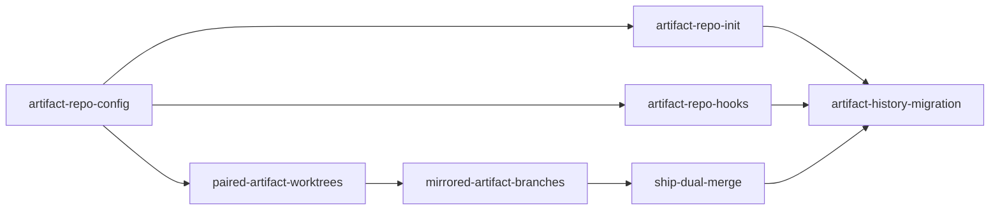

```yaml
initiative: external-artifact-repo
created: 2026-09-15
last-updated: 2026-09-15
```

# External artifact repository: delivery artifacts live in a sibling repo

## Goal

Delivery artifacts — `features/`, `issues/`, and `initiatives/` including every
`plan.md`, `roadmap.md`, `review.md`, `brief.md`, `breakdown.md`, and `evidence/`
screenshot — no longer live inside the product repository. `/agento agento-init`
creates a companion GitHub repository (name configurable, default `<repo>-docs`,
e.g. `prismicon` → `prismicon-docs`), clones it as a sibling directory of the
product checkout, and points `.github/agento.json` at it. Every command that reads
or writes artifacts (the CLI, the hooks, the Planner/Builder/Reviewer/Autopilot/
Architect, `/agento ship`) works against that companion repo through a branch that
mirrors the code branch and a matching pull request, and `/agento ship` merges both.
Agento's own history and the `prismicon` project are migrated onto the new layout.

## Decisions

- **Q: Should all three artifact roots move to the sibling repo, or only some? Should
  the sibling repo also hold `evidence/` screenshots and `review.md`, or only
  plan/roadmap?** A: move all and evidence and everything.
- **Q: Is the sibling repo name a fixed convention, configurable in
  `.github/agento.json`, or asked for during `/agento agento-init`? Should init
  create the GitHub repo or only clone an existing one?** A: name should be
  configurable (prismicon -> prismicon-docs is what my example actually should be).
  Create new repo and clone it
- **Q: What must ship first — the config/resolver plumbing (with the in-repo layout
  still working) or the init/scaffolding? Must existing in-repo `features/` keep
  working, or is a one-way migration acceptable?** A: We will only ship once
  everything is done
- **Q: Branch/PR model for the artifact repo: (a) direct commits to its default
  branch, (b) a matching branch + PR in the artifact repo, or (c) something else?
  Should `/agento ship` merge both?** A: b, yes merge both
- **Q: Target size of each member feature? Anything explicitly out of scope — e.g.
  migrating this Agento repo's own history, non-sibling paths, hosted environments
  where the sibling directory may not exist?** A: We need to migrate this and
  prismicon. Dont worry about nonsibling paths
- **Architect's reading of "we will only ship once everything is done":** the
  initiative counts as delivered only when the migration wave lands; there is no
  intermediate milestone where the plugin is "half external". Member features still
  merge to `main` one PR at a time (Agento has no long-lived integration branch), so
  each of them must leave `main` usable: while `artifacts.repo` is unset in
  `.github/agento.json`, behaviour is byte-for-byte today's in-repo layout, and the
  final migration feature is what flips this repository over. Removing the in-repo
  mode afterwards is listed under Out of scope as a follow-up, not a member.

## Research

Skills consulted: none — no matching domain (the repository has no `.agents/skills/`
directory and its AGENTS.md has no `## Agento` skills table).

- **Every artifact reader resolves paths against the git toplevel of the cwd.**
  [scripts/agento.mjs](../../../../scripts/agento.mjs) sets `root = git rev-parse
  --show-toplevel`, loads config from it, and builds `gitAdapter.lsTree/show` on the
  same repo; `allRoadmaps()` joins `root` with `config.artifacts.features|issues`;
  `walkBreakdowns()` does the same for `initiatives`; `describe()` makes paths
  repository-relative to `root`; `describeFromRef()` reads `origin/<branch>:<path>`
  from the product repo. [scripts/delivery-roadmap-resolver.mjs](../../../../scripts/delivery-roadmap-resolver.mjs)
  `findLocalRoadmaps()` and `resolveRoadmapArtifact()` walk `path.join(rootDir,
  roots[type])` and fall back to `git ls-tree origin/<branch>` — again the product
  repo. The `resolve`, `find`, `status`, `close-decision`, `ship-preflight`,
  `initiative`, `session`, and `next` subcommands all sit on these readers, so one
  root indirection covers the CLI.
- **Config has no notion of a second repository.**
  [scripts/agento-config.mjs](../../../../scripts/agento-config.mjs) `defaultConfig()`
  exposes `artifacts.{features,issues,initiatives}` as repo-relative strings,
  `worktrees.dir` (sibling `../<repo>-worktrees`), `branches.*`, and
  `checks.releaseWorkflow`; `mergeConfig()` treats `null` as "keep default".
  [templates/agento.json](../../../../templates/agento.json) and
  [docs/project-profile.md](../../../../docs/project-profile.md) mirror the same
  keys. `doctor` ([scripts/agento.mjs](../../../../scripts/agento.mjs) `DOCTOR_CHECKS`)
  probes `node`, `git-remote`, `gh`, `code`, `python3`, `worktrees-dir` — nothing
  about a companion checkout.
- **Both hooks re-implement the config read in Python and assume in-repo roots.**
  [scripts/hooks/session-context.sh](../../../../scripts/hooks/session-context.sh)
  walks `os.path.join(root, base)` for `features`/`issues` to print `Delivery work:`
  lines and calls `agento.mjs session --root <cwd>`.
  [scripts/hooks/delivery-guard.sh](../../../../scripts/hooks/delivery-guard.sh)
  `agento_config()` merges `.github/agento.json` over defaults, derives the protected
  default branch and prefixes from it, and its roadmap nudge (L341–342) asks when a
  commit on a delivery branch contains no `roadmap.md` — which becomes always-true
  once the roadmap lives in another repo. Hook edits are approval-gated by the guard
  itself (AGENTS.md; guard PROTECTED regex), and the guard's `GIT` regex already
  tolerates `git -C <dir>`, so protecting the companion repo's default branch is a
  config question, not a parser change. Fixtures: [tests/guard-fixtures.txt](../../../../tests/guard-fixtures.txt),
  [tests/guard.test.mjs](../../../../tests/guard.test.mjs),
  [tests/session-context.test.mjs](../../../../tests/session-context.test.mjs).
- **Sessions are single-repo worktrees.** `agento.mjs paths <kind> <id>` derives
  `<worktrees.dir>/<kind>-<id>` and a branch; [session-state.mjs](../../../../scripts/session-state.mjs)
  `classifyByPath()` derives `role` from `git worktree list --porcelain` of the
  product repo plus the `MANAGED_DIR` name prefix, and `deriveDelivery()` joins the
  branch prefix with the roadmap list. `/agento start-session` creates one worktree
  and opens one VS Code window; `/agento close-session` and `/agento ship` teardown
  remove one worktree. Concurrent sessions
  ([concurrent-delivery.instructions.md](../../../../.github/instructions/concurrent-delivery.instructions.md))
  mean the companion repo cannot be a single checkout that switches branches — each
  session needs its own companion worktree on the mirrored branch.
- **Artifacts are committed on the code branch and reviewed in the code PR.**
  Policy §7 ("commit each roadmap step together with its roadmap.md update") and §3
  (evidence committed with the roadmap) in
  [delivery-policy.instructions.md](../../../../.github/instructions/delivery-policy.instructions.md);
  the Planner commits plan/roadmap on `feature/<slug>` and opens the draft PR; the
  Builder ticks steps per commit; the Reviewer writes `review.md` on the branch;
  [ship.prompt.md](../../../../.github/prompts/ship.prompt.md) step 1 reads
  roadmap/review from `origin/<branch>` of the product repo, step 3 commits
  `status: complete` on that branch before marking the PR ready and merging, and
  step 5 lands post-ship evidence on `post-ship/<slug>`. `ship-preflight` and
  `close-decision` in the resolver reason about one branch owner. The Architect
  ([initiative-architect.agent.md](../../../../.github/agents/initiative-architect.agent.md))
  commits `brief.md`/`breakdown.md` on `changes/initiative-<slug>` in the product
  repo; `/agento triage-followups` edits `review.md`/`roadmap.md` in place.
- **Guidance hard-codes the in-repo layout.** The `applyTo` of
  [delivery-artifacts.instructions.md](../../../../.github/instructions/delivery-artifacts.instructions.md)
  and [concurrent-delivery.instructions.md](../../../../.github/instructions/concurrent-delivery.instructions.md)
  is `features/**,issues/**,initiatives/**`; [templates/project.instructions.md](../../../../templates/project.instructions.md)
  and [templates/AGENTS-section.md](../../../../templates/AGENTS-section.md) repeat
  the paths; [agento-init.prompt.md](../../../../.github/prompts/agento-init.prompt.md)
  steps 2–3 and 6 create the roots in the product repo and embed the config JSON;
  [docs/artifacts.md](../../../../docs/artifacts.md), [docs/concurrency.md](../../../../docs/concurrency.md),
  [docs/architecture.md](../../../../docs/architecture.md), [docs/install.md](../../../../docs/install.md),
  and README describe the same. `tests/customizations.test.mjs` requires relative
  links to resolve, `§N` references to exist, `Needs:` lines to agree with
  `doctor --for`, and `commands/*.md` to be byte-identical to
  `.github/prompts/*.prompt.md`.
- **Editor boundary.** Copilot's file tools operate on workspace folders; a companion
  checkout outside the opened folder is invisible to `applyTo` instructions and to
  the edit tools. VS Code multi-root workspaces (`.code-workspace` files, or `code
  --add`) are the supported way to expose a second folder, and `applyTo` globs match
  from the root of each workspace folder.
- **Migration inputs.** This repository carries 10 feature and 1 issue directories
  under `features/2026/09/` and `issues/2026/09/` plus one initiative
  (`initiatives/2026/09/workflow-orchestration/`), several with `evidence/`. Tests
  do not read `features/`; only prose links (e.g. plan.md research bullets with
  `../../../../` links) point back into the product tree and will need re-basing or
  acceptance as historical.

## Features

### artifact-repo-config

- Summary: `.github/agento.json` gains an `artifacts.repo` block; the CLI resolves
  every artifact path and git-ref read against the companion repository when it is
  set, with `doctor` verifying the companion checkout.
- Brief: "features/ issues/ and initiatives/ folders are actually in their own repo
  outside of the repo using the plugin".
- Requires: none
- Recommended after: none
- Wave: 1
- Size: M
- Independence: Pure CLI + config change with unit tests; with `artifacts.repo`
  unset every subcommand behaves exactly as today. Detail for the Planner:
  `defaultConfig()` adds `artifacts.repo: { name: null, dir: null }` where `name`
  defaults to `<repo>-docs` and `dir` to `../<name>` (sibling only, per Decision 5);
  `loadAgentoConfig()` returns a resolved `artifactsRoot` (absolute path of the
  companion checkout, or the product root when unset). `agento.mjs` gets a second
  git adapter bound to that root and routes `allRoadmaps`, `walkBreakdowns`,
  `describe`, `describeFromRef`, `findLocalRoadmaps`, `resolveRoadmapArtifact`, and
  `paths` through it; `config` output reports `artifactsRoot`; `doctor` gains an
  `artifact-repo` check (directory exists, is a git checkout, has `origin`, default
  branch reachable) with a fallback naming `/agento agento-init`. Mirror the key in
  `templates/agento.json`, `docs/project-profile.md`, and the config snippet in
  `agento-init.prompt.md`. Resolver tests gain fixtures with a companion root.

### artifact-repo-init

- Summary: `/agento agento-init` creates the companion GitHub repository, clones it
  as a sibling directory, scaffolds the three artifact roots there, protects its
  default branch, and writes `artifacts.repo` into the product config.
- Brief: "there should be a new repo created during init that sets in the same
  directory as the prismicon repo called prismicons-demo" (corrected in Decisions to
  `prismicon-docs`).
- Requires: artifact-repo-config
- Recommended after: none
- Wave: 2
- Size: M
- Independence: Prompt + template change with no runtime dependency on the session or
  ship features; a target repo initialised this way is immediately readable by the
  `artifact-repo-config` CLI. Detail for the Planner: ask the companion name with the
  ask-questions tool (default `<repo>-docs`, validated as a GitHub repo name); create
  it with `gh repo create <owner>/<name>` (same owner and visibility as the product
  repo) and clone into `../<name>`; write a README, `.gitkeep` in each root, and the
  ruleset from today's step 7 (`pull_request` + `non_fast_forward` + `deletion`; no
  required status checks unless the companion has CI); the product repo receives only
  `.github/agento.json` (with `artifacts.repo.name`) and the AGENTS `## Agento`
  section — no `features/`, `issues/`, `initiatives/` roots. Idempotency: an existing
  companion repo or clone is adopted, never re-created; `--force` still only rewrites
  files. Update `templates/AGENTS-section.md`, `templates/project.instructions.md`
  (`applyTo` unchanged — the globs match from the companion folder's root), docs/install.md,
  and docs/project-profile.md.

### artifact-repo-hooks

- Summary: Both hooks read `artifacts.repo` and operate on the companion checkout:
  SessionStart lists resumable work from it, and the delivery guard protects the
  companion default branch and re-targets the roadmap nudge.
- Brief: "features/ issues/ and initiatives/ folders are actually in their own repo
  outside of the repo using the plugin" — the enforcement and context layer.
- Requires: artifact-repo-config
- Recommended after: none
- Wave: 2
- Size: M
- Independence: Approval-gated hook edits plus fixtures; unset `artifacts.repo`
  keeps today's output verbatim (existing `tests/session-context.test.mjs` and
  `tests/guard.test.mjs` stay green). Detail for the Planner:
  `session-context.sh` resolves the companion root the same way the CLI does and
  walks it for `Delivery work:` lines, also printing an `Artifacts:` line naming the
  companion path and its checked-out branch; `delivery-guard.sh` `agento_config()`
  learns `artifacts.repo`, protects the companion's default branch for `git -C
  <companion>` pushes and commits (same DENY rules as the product default branch),
  and replaces the "commit without roadmap.md" nudge with: on a delivery branch,
  asking when the companion checkout for that branch has no staged or recently
  committed `roadmap.md` change — never asking merely because the product commit
  lacks one. Add the companion worktree path to the occupant check performed on
  `git worktree remove`. Replay fixtures cover both repos.

### paired-artifact-worktrees

- Summary: Every managed session owns a pair of worktrees — product and companion —
  on the same branch name, opened together as one multi-root VS Code workspace, and
  `agento.mjs session`/`paths`/`next` describe both.
- Brief: "features/ issues/ and initiatives/ folders are actually in their own repo
  outside of the repo using the plugin" — the session mechanics that make the
  companion editable from a build window.
- Requires: artifact-repo-config
- Recommended after: artifact-repo-hooks
- Wave: 2
- Size: L
- Independence: Changes `start-session`, `close-session`, `continue`, `paths`,
  `session`, and `session-state.mjs` without touching how artifacts are committed
  (that is `mirrored-artifact-branches`); a session started this way can still run
  today's Planner/Builder, which simply write into the companion folder of the
  workspace. Detail for the Planner: `paths <kind> <id>` returns
  `{ worktree, branch, companion: { worktree, branch } }` with the companion
  worktree at `<worktrees.dir>/<kind>-<id>-docs` (or a parallel
  `<companion>-worktrees/` dir — decide and document once); `start-session` creates
  both worktrees (companion branch created from the companion default branch, or
  checked out from `origin/<branch>` on `--resume`), writes a
  `<kind>-<id>.code-workspace` file listing both folders inside `worktrees.dir`,
  and opens it with `code --new-window <file>` (fallback per §10 prints the
  command); `session` adds `companion: { path, branch, detached, dirty, ahead }` and
  `worktrees[]` entries are tagged `repo: product|companion`; `deriveRole()` accepts
  a cwd inside either half of the pair; `close-session` and `ship` teardown remove
  both worktrees and the workspace file, with `close-decision` refusing while either
  half has unpushed commits. Policy §8/§11 and `docs/concurrency.md` describe the
  pair; `customizations.test.mjs` keeps the `§N` references valid.

### mirrored-artifact-branches

- Summary: Planner, Builder, Reviewer, Autopilot, Architect, and
  `/agento triage-followups` write artifacts into the companion worktree, commit
  them on the mirrored branch, and keep a companion draft PR alongside the code PR.
- Brief: "features/ issues/ and initiatives/ folders are actually in their own repo"
  with the Decision-4 model: "a matching branch + PR in the artifact repo".
- Requires: paired-artifact-worktrees
- Recommended after: artifact-repo-hooks
- Wave: 3
- Size: L
- Independence: Prose change across agents, prompts, and policy §3/§5/§7 plus the
  artifact-format contract; the CLI already resolves companion paths and sessions
  already provide the pair, so this feature is the first that produces a real
  two-PR delivery and can be verified end to end on a throwaway slug. Detail for the
  Planner: the Planner commits `plan.md`/`roadmap.md` in the companion worktree
  (`git -C <companion>`), pushes with upstream, and opens a draft PR there titled
  `docs(<type>): <slug>` whose body links the code PR (and vice versa via `gh pr
  edit`); `roadmap.md` gains an optional `artifact-pr:` header next to
  `github-issue`; the Builder's per-step commit becomes two commits (code in the
  product worktree, roadmap tick + evidence in the companion) pushed together, with
  §7 rewritten to say so and the pause/resume protocol reading both; the Reviewer
  writes `review.md` in the companion and comments on the code PR; the Architect
  writes `brief.md`/`breakdown.md` on `changes/initiative-<slug>` in the companion
  repo and merges that PR there; `triage-followups` and `new-issue` commit in the
  companion. `resolve`/`find` look at the companion's `origin/<branch>` for remote
  roadmaps; `session --pr` returns both PRs; `agento.mjs initiative` reads the
  companion. Concurrent-delivery integration steps merge the companion's default
  branch into the companion branch alongside the product merge.

### ship-dual-merge

- Summary: `/agento ship` audits both halves, commits `status: complete` in the
  companion, marks both PRs ready, merges the code PR and then the companion PR
  through their rulesets, syncs both default branches, tears the pair down, and lands
  post-ship evidence on the companion's `post-ship/<slug>`.
- Brief: "yes merge both" (Decision 4).
- Requires: mirrored-artifact-branches
- Recommended after: none
- Wave: 4
- Size: M
- Independence: Ship is the only command that merges, so the two-PR rule can be
  encoded in one prompt plus `ship-preflight`; everything before it already produces
  the two branches. Detail for the Planner: `ship-preflight` reports `{ product: {
  branch, owner, pr }, companion: { branch, owner, pr } }` and treats a missing
  companion PR, a `CONFLICTING` companion PR, or unpushed companion commits as
  hard-reject gaps; audit reads roadmap/review from the companion's
  `origin/<branch>`; ordering is code PR first (its checks are the real gate), then
  the companion PR after a bounded `wait-for-checks.sh` on each; a companion merge
  failure after the code merge is a resumable blocker whose re-send resumes at the
  companion merge (extend the §9 idempotency row); teardown removes both worktrees
  and the workspace file; the release-workflow hook is unchanged; the epilogue's
  `post-ship/<slug>` branch and PR live in the companion repo. Idempotency table,
  `docs/commands.md`, and `README.md` flow text updated.

### artifact-history-migration

- Summary: A documented, CLI-assisted migration moves an existing in-repo
  `features/`, `issues/`, and `initiatives/` tree into a freshly initialised
  companion repo, applied to this repository (`agento` → `agento-docs`) and
  reproducible for `prismicon` → `prismicon-docs`.
- Brief: "We need to migrate this and prismicon" (Decision 5); "Instead of those
  folders being inside the prismicon repo".
- Requires: artifact-repo-init, artifact-repo-hooks, ship-dual-merge
- Recommended after: none
- Wave: 5
- Size: M
- Independence: Runs only after every reader, writer, hook, and ship path handles the
  companion; the migration itself is one PR in the product repo (removing the roots
  and setting `artifacts.repo`) plus an import PR in the companion. Detail for the
  Planner: add `/agento agento-init --migrate` (or a documented step inside init)
  that, when the product repo already has artifact roots, moves them into the
  companion with history preserved where feasible (`git subtree split` per root, or
  a single import commit if history preservation is rejected during clarification —
  record the choice), verifies `agento.mjs status`, `initiative`, and `session` read
  identical records before and after, rewrites the `../../../../` research links in
  moved plans to companion-relative form or documents them as historical, and opens
  both PRs. Dogfood it on this repository as the feature's own acceptance test;
  the `prismicon` run is the user's, performed with the same command, and its
  success screenshot is the initiative's final evidence. Update README, docs, and
  the CHANGELOG with a `## <version> (unreleased)` entry that bumps the plugin
  version for the layout change.

## Recommended order

- **Wave 1 — artifact-repo-config.** The single indirection every later feature
  relies on; land it first so the companion root is data, not prose.
- **Wave 2 — artifact-repo-init, artifact-repo-hooks, paired-artifact-worktrees.**
  Independent of each other and each testable on its own: init creates companions,
  hooks read them, sessions open them. Hooks before worktrees is only a soft
  preference so the occupant check knows about the companion path when sessions
  start creating one.
- **Wave 3 — mirrored-artifact-branches.** The first feature that changes what a
  delivery produces; it needs the pair of worktrees to exist and benefits from the
  guard already protecting the companion default branch.
- **Wave 4 — ship-dual-merge.** Depends on both PRs existing.
- **Wave 5 — artifact-history-migration.** Flips this repository (and then
  `prismicon`) over once the full path is proven; nothing before it removes the
  in-repo roots.



## Risks

- **Editor cannot reach the companion folder.** Copilot's edit tools and `applyTo`
  instructions see only workspace folders. Mitigation: `paired-artifact-worktrees`
  opens every session as a multi-root workspace containing both halves, and the
  primary window is documented (docs/install.md, `agento-init` report) as a
  two-folder workspace as well; `doctor` warns when the companion folder is not a
  workspace folder (detectable from the hook's cwd list) — verify during planning of
  `artifact-repo-config` whether that signal is available and otherwise document it.
- **Two PRs can diverge: code merged, companion not.** Mitigation: `ship-dual-merge`
  merges code first, treats a failed companion merge as a resumable blocker with a
  dedicated idempotency row, and `status: complete` is only written in the companion
  commit that precedes both merges; `delivery-status` flags a merged code PR with an
  open companion PR as a warning (lifecycle stays `in-review`).
- **Guard blind spots.** The roadmap nudge currently keys on the same commit; a naive
  port would ask on every product commit. Mitigation: `artifact-repo-hooks`
  re-targets the nudge to the companion checkout and adds replay fixtures for both
  repos; the companion default branch is protected by the same DENY rules and a
  server-side ruleset created by `artifact-repo-init`.
- **Concurrent sessions sharing one companion clone.** Two sessions switching
  branches in `../<repo>-docs` would corrupt each other's uncommitted artifacts.
  Mitigation: one companion worktree per session (`paired-artifact-worktrees`); the
  sibling clone itself stays on the companion default branch and is only touched by
  the primary window (Architect, `triage-followups`, ship's `main` sync).
- **Intermediate `main` must stay usable.** Members ship one at a time. Mitigation:
  unset `artifacts.repo` is byte-for-byte today's behaviour in every member; only
  `artifact-history-migration` sets it for this repository.
- **History preservation is fiddly across three roots.** `git subtree split` per
  root and `git filter-repo` both have sharp edges. Mitigation: decide during the
  migration feature's clarification whether a single import commit is acceptable
  (history remains in the product repo's log either way); record the decision.
- **Hosted environments** (Codespaces, Actions) have no sibling directory.
  Mitigation: out of scope per Decision 5; `doctor` reports the missing companion as
  `fail` with the fallback naming a local checkout, and the hooks' hosted path keeps
  deriving role from the branch alone.

## Out of scope

- Non-sibling companion locations (absolute paths, nested directories, monorepo
  subfolders) — Decision 5.
- Removing the in-repo (`artifacts.repo` unset) mode after the migration; it stays
  as the default until a follow-up decides otherwise.
- Hosted/Codespaces support for the companion checkout.
- Migrating `prismicon` from inside this repository — the migration feature ships
  the command; the user runs it in `prismicon` and the result is verified there.
- Changing the artifact formats themselves (plan/roadmap/review/brief/breakdown)
  beyond the optional `artifact-pr:` roadmap header.
- Freehand (`/agento start-freehand`, `/agento finish-freehand`,
  `/agento quick-fix`, `/agento commit-current-changes`) — these produce no
  artifacts and are unaffected.

## Definition of done

- `/agento agento-init` in a fresh product repo creates and clones `<repo>-docs` (name
  confirmed by the user), scaffolds the three roots there, protects its default
  branch, and leaves no artifact roots in the product repo.
- A full delivery (`/agento start-session` → `/agento new-feature` → `/agento
  build-feature` → `/agento review-feature` → `/agento ship`) on a throwaway slug
  produces a code PR and a companion PR, ticks roadmap steps and lands evidence in
  the companion, and `/agento ship` merges both, syncs both default branches, and
  removes both worktrees and the workspace file.
- `agento.mjs session`, `status`, `initiative`, `next`, `doctor`, and both hooks
  report companion-backed state; with `artifacts.repo` unset every existing test
  passes unchanged.
- This repository's `features/`, `issues/`, and `initiatives/` live in `agento-docs`
  with `.github/agento.json` pointing at it, and the same command has migrated
  `prismicon` → `prismicon-docs` (user-verified, evidence attached to the migration
  feature).
- README, docs/install.md, docs/artifacts.md, docs/concurrency.md,
  docs/project-profile.md, docs/commands.md, the delivery policy, and the CHANGELOG
  describe the companion-repo layout; `tests/customizations.test.mjs` is green.
