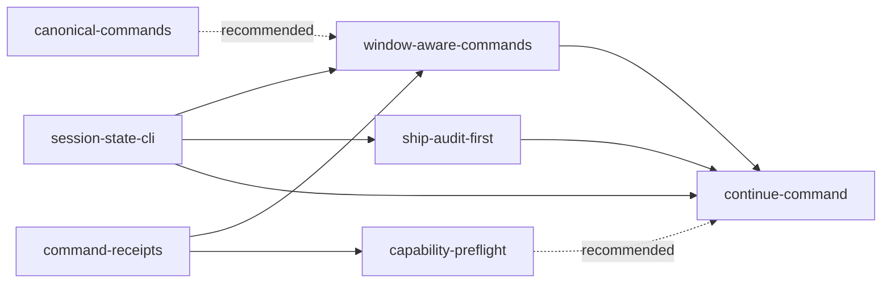

```yaml
initiative: workflow-orchestration
created: 2026-09-14
last-updated: 2026-09-14
```

# Workflow orchestration: the plugin owns state detection and transition selection

## Goal

Stop exposing Agento's internal state machine to the user. After this initiative, any
window can answer "where am I, what is active, what may I run next" from one CLI
call; every command opens with an execution receipt and closes with a terminal
result; duplicate submissions are harmless; `/agento continue` derives and performs
the next legal transition (including cross-window ones); `/agento ship` audits while
the build worktree still exists so rejected findings go straight back to the open
build window; commands preflight the tools and execution mode they need and name the
fallback before starting; and command invocation has one canonical spelling with old
forms recognised and redirected.

## Decisions

- **Q: This brief spans five independently shippable changes. How should I proceed?**
  A: Decompose into an initiative (Architect).
- **Q: Plugin commands are always namespaced (`/agento ship`). Bare `/ship` or
  `.prompt` suffixes can't be registered by the plugin itself. What should
  "compatibility aliases" mean?** A: Recognize old forms in text and redirect —
  prompts/agents/docs treat `/ship`, `/agento ap.prompt` etc. as typos: name the
  canonical command and proceed with it, no extra confirmation.
- **Q: What may `/agento continue` do on its own?** A: Also perform cross-window
  transitions — it may create worktrees and open VS Code windows (start-session
  semantics) when the next step needs one.
- **Q: How should ship findings be repaired?** A: Audit before teardown (ship absorbs
  close) — `/agento ship` runs its audit while the secondary worktree still exists.
  Rejected findings send the user back to the still-open build window; close-session
  only happens after a clean audit/merge.
- **Q: How should execution receipts and idempotency be backed?** A: Policy contract
  + deterministic IDs, no journal — receipts are a policy section every command
  prints (accepted/rejected/completed/failed); idempotency is derived from git +
  roadmap state (no new files). Operation IDs are deterministic (command + slug +
  HEAD).
- **Q: What form should capability preflight take?** A: CLI `doctor` + per-command
  tool declarations — new `agento.mjs doctor` checks gh auth, code CLI, git remote,
  python3, node version; prompts also declare which chat tools they need and their
  fallback (e.g. ask-questions unavailable → numbered questions in chat).
- **Q: May the SessionStart hook be extended to emit the new state summary? (Hook
  edits are approval-gated.)** A: Yes, hook emits the state summary.

## Research

Skills consulted: none — no matching domain (the repository has no `.agents/skills/`
and no skills table in AGENTS.md).

- **Role detection today is prose, repeated per prompt.** `commands/start-session.md`
  L19–20, `commands/close-session.md` L23–24, `commands/quick-fix.md` L36,
  `commands/new-initiative.md` L10, `commands/start-freehand.md` L22, and
  `commands/finish-freehand.md` L14 each tell the model to run `git worktree list
  --porcelain` and decide whether "the current workspace is the primary worktree".
  `commands/ship.md` L21–27 does the same for the roadmap branch. Nothing returns the
  role as data; the two "mistook the primary window for a secondary worktree"
  incidents come from this.
- **The CLI has no role/window subcommand.** `scripts/agento.mjs` exposes `config`,
  `resolve`, `find`, `status`, `close-decision`, `ship-preflight`, `ports`, `paths`,
  `initiative`. `status` (L322–332) lists roadmaps with a `resumable` array but
  knows nothing about worktrees. `closeBuildSessionDecision()` in
  `scripts/delivery-roadmap-resolver.mjs` (L188–215) infers "managed worktree
  present" from a regex over `git worktree list --porcelain` plus `currentBranch !==
  default` — a heuristic, not a role. `paths <kind> <id>` (L358–374) already derives
  the managed worktree path `<worktrees.dir>/<kind>-<id>` and the branch, so a
  reverse mapping (cwd → role/kind/id) is a small addition.
- **Lifecycle state is spread across roadmap header, review.md, and GitHub.**
  `describe()` (agento.mjs L109–131) reads `status`, `branch`, `nextStep`,
  `reviewVerdict`, step counts, `postShipPending`; PR state is fetched by prompts
  via `gh pr view` (ship.md step 1; delivery-status.md). No single record combines
  them, so "allowed next commands" cannot be computed today.
- **SessionStart hook output** (`scripts/hooks/session-context.sh`, Python heredoc
  L13–77) prints `Current git branch`, `Agento CLI: node …/agento.mjs`, and one
  `Delivery work: … [status: …] next-step: …` line per resumable roadmap. It does not
  say which window this is. Tests: `tests/session-context.test.mjs` (5 tests, regex
  over `additionalContext`). Hook edits are approval-gated by
  `scripts/hooks/delivery-guard.sh` (PROTECTED regex L108–111).
- **Cross-window handoff is policy §8** (`delivery-policy.instructions.md`): build and
  review in the secondary window, close and ship in the primary; "never substitute
  raw git or worktree commands for these workflow commands". Any change to the
  close→ship order must update §8 and the docs that restate the flow
  (`docs/commands.md` "The standard flow" and "The initiative flow", `README.md`
  "The full delivery flow", `docs/architecture.md` mermaid, `commands/next-feature.md`
  L34–38, `.github/agents/delivery-reviewer.agent.md` and `delivery-builder.agent.md`
  final-handoff text, `CHANGELOG.md`).
- **Ship currently requires teardown first.** `commands/ship.md` L21–27: if a
  secondary worktree owns the branch, stop and direct the user to
  `/agento close-session`, then rerun. Step 3 sets `status: complete`, marks the PR
  ready, waits with `scripts/wait-for-checks.sh pr <n>`, merges, syncs `main`;
  step 5 is the post-ship epilogue. `commands/close-session.md` "Build close"
  L49–63 uses `agento.mjs close-decision`, requires zero unpushed commits, removes
  the worktree, and reports whether `/agento ship <slug>` is next. Inverting the
  order means ship must audit against the branch as checked out in the secondary
  worktree (or `origin/<branch>`), and perform the close-session steps itself after
  the merge.
- **Packaging.** `plugin.json` → `"commands": "commands"`, `"agents":
  ".github/agents"`; `commands/*.md` are byte-identical copies of
  `.github/prompts/*.prompt.md`, asserted by `tests/customizations.test.mjs`
  ("plugin manifest and hook wiring…", L191–215). The same file asserts every
  prompt is listed in `README.md` and `docs/commands.md` (L183–189) and that
  guidance never uses an unqualified `/<command>` (L191–212, scanning README,
  AGENTS.md, agents, prompts, instructions, `commands/`, `docs/`, `templates/`). No
  test rejects the `.prompt` suffix in an invocation, and no prose tells the model
  what to do with `/ship` or `/agento ap.prompt`.
- **Ask-questions dependency.** `commands/agento-init.md` L43, L100,
  `commands/install-skills.md` L36 name `vscode/askQuestions`; the Planner
  (`delivery-planner.agent.md` L47–49) and Architect
  (`initiative-architect.agent.md` L50) say "the ask-questions tool". None declares
  a fallback when the tool is absent or when the chat is in a mode that cannot
  execute terminal commands.
- **Prerequisite checks are ad hoc.** Policy §1 says "check it with `command -v`
  before invoking a CLI not yet proven in this session"; there is no single doctor.
  Hooks need `python3` (both hooks), the CLI needs Node ≥ 20 (AGENTS.md), sessions
  need `code` (start-session L33–37 already handles its absence), publishing needs
  `gh` auth.
- **Receipts.** Agents end with "a concrete suggested next step" (AGENTS.md last
  rule) but nothing requires an opening acknowledgement, an operation ID, or a
  typed terminal result. Duplicate `/agento new-feature`: the Planner's resume
  protocol (`delivery-planner.agent.md`) handles an existing roadmap; duplicate
  `/agento build-feature` re-enters the Builder's resume/audit path; duplicate
  `/agento ship` on a `status: complete` roadmap skips to the epilogue (ship.md
  L18–19). Idempotency therefore mostly exists but is undocumented and unverified.
- **Docs to keep in sync** (customizations test + convention): `README.md` command
  table and flow, `docs/commands.md` table + CLI paragraph + flows,
  `docs/architecture.md`, `docs/hooks.md`, `docs/concurrency.md`,
  `templates/AGENTS-section.md` (command list echoed in `commands/agento-init.md`
  step 4), `CHANGELOG.md` (`## <version> (unreleased)` heading; `/agento ship`
  stamps the date when `plugin.json`/`package.json` versions change — both `0.3.0`).

## Features

### session-state-cli

- Summary: `agento.mjs session` — the authoritative role/worktree/delivery/lifecycle
  record — emitted by the SessionStart hook and shown by `/agento delivery-status`.
- Brief: "Agento needs a canonical status command consumed by every workflow,
  returning the current role, active delivery, owning worktree, lifecycle state, and
  allowed next commands." Priority 1: "Add authoritative worktree/window/session-state
  detection."
- Requires: none
- Recommended after: none
- Wave: 1
- Size: M
- Independence: Adds a new CLI subcommand with tests, extends the hook's
  `additionalContext` with a `Session:` summary (approval-gated edit), and adds the
  record to the dashboard. Existing prompts keep working unchanged; consumers adopt it
  in `window-aware-commands`. Detail for the Planner: derive `role` from
  `git worktree list --porcelain` + cwd + `worktrees.dir` + directory-name prefix
  (`primary` | `plan` | `build` | `freehand` | `unmanaged`), `worktree` (path,
  branch, detached, isPrimary), `delivery` (type/slug from the branch prefix or the
  promoted plan worktree, roadmap fields from `describe()`, `reviewVerdict`, PR
  number/state/`mergeStateStatus` via `gh` when available with a `null` +
  `warnings[]` fallback), `lifecycle` (one of `no-delivery | planned | building |
  paused | in-review | approved | shipped | post-ship-pending` derived from those
  fields), `allowed` (the `/agento …` commands legal in this window for this state)
  and `elsewhere` (commands that need another window, with which one). Every other
  subcommand's window checks eventually route through the same function.

### command-receipts

- Summary: Policy section for execution receipts and idempotency; every prompt and
  agent opens with `accepted`/`rejected` and closes with `completed`/`failed`.
- Brief: "Every command needs an immediate execution receipt and a terminal result:
  accepted with operation ID; rejected with reason and allowed alternatives; completed
  with resulting state; failed with a retry-safe explanation. Commands should also be
  idempotent so duplicate submissions cannot corrupt lifecycle state." Priority 3.
- Requires: none
- Recommended after: none
- Wave: 1
- Size: M
- Independence: Pure customization-file change (new `## 9. Execution receipts` in
  `delivery-policy.instructions.md`, one-line citations in every command and agent,
  a `customizations.test.mjs` assertion that each prompt body cites §9, and a
  canary so the receipt format is spelled out once). Operation ID is deterministic:
  `<command>:<slug-or-session-id>:<short HEAD sha>`; a duplicate submission yields
  the same ID and the receipt says `accepted (duplicate of <id>; resuming)`.
  Idempotency is defined per command in that section (re-plan → Planner resume
  protocol; re-build → Builder audit/resume; re-ship on `complete` → epilogue;
  re-start-session on an existing worktree → `--resume` semantics; re-close on a
  removed worktree → success with "already closed"), all derived from git + roadmap
  state. Testable via the customizations suite alone.

### canonical-commands

- Summary: One canonical spelling per command, old forms recognised and redirected,
  and packaging tests that fail on `.prompt` suffixes or unqualified names.
- Brief: "`/agento agento-init.prompt` was treated as ordinary text because commands
  were exported with the wrong path and `.prompt` suffix … Invocation style also
  varied between `/agento ship`, `/ship`, `/agento ap.prompt`, `/ap`. Canonical command
  names, aliases for old forms, and packaging tests should make command invocation
  unambiguous." Priority 4.
- Requires: none
- Recommended after: command-receipts
- Wave: 1
- Size: S
- Independence: Adds a short "Invocation" paragraph to the policy (or a new
  `command-invocation.instructions.md`) stating the canonical form `/agento <name>`
  and the redirect rule from the decision (a bare `/<name>`, a `.prompt`/`.md`
  suffix, or `/agento <name>.prompt` names the canonical command; say which and
  proceed, no confirmation); adds a `## Invocation` table to `docs/commands.md`;
  extends `tests/customizations.test.mjs` to reject `\.prompt\b` after a command
  name anywhere in guidance and to assert `plugin.json` `commands` is a directory of
  suffix-less `.md` files (already partly covered — tighten and name the test after
  this defect). No behaviour change to any command.

### capability-preflight

- Summary: `agento.mjs doctor` plus per-command tool and execution-mode
  declarations with an explicit fallback, printed inside the acceptance receipt.
- Brief: "Some workflows discovered too late that `vscode_askQuestions` was
  unavailable; Plan mode could not execute `/start-session`; destructive steps
  required manual terminal confirmation; shipping stopped at a confirmation gate
  without a streamlined repair path. … Commands should preflight required
  capabilities before starting and declare the fallback immediately." Priority 5.
- Requires: command-receipts
- Recommended after: session-state-cli
- Wave: 2
- Size: M
- Independence: `doctor` is a self-contained subcommand (`git` remote reachable,
  `gh auth status`, `code` CLI, `python3`, Node ≥ 20, `worktrees.dir` writable) with
  `ok | warn | fail` per check and a `fallback` string, tested in
  `scripts/agento.test.mjs` with PATH manipulation. Each command file gains a
  `Needs:` line (terminal, ask-questions, browser, `gh`, `code`) and a `Fallback:`
  line (ask-questions → numbered questions in chat and wait; `code` → print the open
  command; execution mode cannot run terminal → reject with the receipt naming the
  mode to switch to). The receipt format comes from `command-receipts`, hence the
  hard dependency.

### window-aware-commands

- Summary: Every window-sensitive prompt and agent consumes `agento.mjs session`
  instead of re-deriving worktree state, and rejects wrong-window invocations with a
  receipt naming the right window and command.
- Brief: "The agent twice mistook the primary window for a resumed secondary
  worktree … Commands had different validity depending on whether they ran in the
  primary, planning, or build window." Priority 1 (consumption half of the
  "canonical status command consumed by every workflow").
- Requires: session-state-cli, command-receipts
- Recommended after: canonical-commands
- Wave: 2
- Size: M
- Independence: Replaces the prose `git worktree list --porcelain` checks in
  `start-session`, `close-session`, `ship`, `quick-fix`, `new-initiative`,
  `start-freehand`, `finish-freehand`, `commit-current-changes`, `build-*`,
  `review-*`, `new-feature`/`new-issue` and in the Planner/Builder/Reviewer/Architect
  agents with a single `Run agento.mjs session; require role … else reject` step;
  `closeBuildSessionDecision()` reuses the same role function instead of its regex
  heuristic. Ships as a prose+resolver change with the resolver tests updated; the
  order of close and ship is untouched here.

### ship-audit-first

- Summary: `/agento ship` audits and merges while the build worktree still exists,
  then performs the close-session steps itself; rejected findings return the user to
  the still-open build window.
- Brief: "When `/ship` found problems after `/close-session`, recovery became
  especially awkward … Ship audits should also happen before teardown." Priority 2
  (repair path).
- Requires: session-state-cli
- Recommended after: window-aware-commands
- Wave: 2
- Size: M
- Independence: Changes `commands/ship.md` (drop the "secondary worktree owns it →
  close first" precondition; audit from the primary worktree against
  `origin/<branch>` after requiring zero unpushed commits in the owning worktree via
  `agento.mjs session`/`close-decision`; on rejected gaps, report the exact build
  command for the open secondary window and stop with a `rejected` receipt; after the
  merge run the build-close steps: remove the managed worktree, prune, delete the
  merged local branch, sync `main`), `commands/close-session.md` (still valid
  standalone; documents that ship now does this), policy §8, and the flow text in
  README/docs/next-feature/Reviewer/Builder handoffs. Adds `evaluateShipPreflight`
  coverage for the "worktree present" path in the resolver tests. Delivered
  independently of `/agento continue`.

### continue-command

- Summary: `/agento continue [slug]` derives the next legal transition from
  `agento.mjs session` (plus a new `agento.mjs next`) and performs it — including
  creating worktrees and opening windows — or names the exact command for another
  window.
- Brief: "The user frequently became the workflow coordinator: `next-feature →
  start-session → new-feature → build → review → close → ship` … The highest-leverage
  change would be a `/continue` command that derives and performs the next legal
  transition." Priority 2. "Most of the observed friction would disappear if the
  plugin owned state detection and transition selection."
- Requires: session-state-cli, window-aware-commands, ship-audit-first
- Recommended after: capability-preflight
- Wave: 3
- Size: L
- Independence: New prompt `commands/continue.md` (+ `.github/prompts/continue.prompt.md`)
  and a pure `next` function in the CLI (`session` record → `{ command, args,
  window: here | primary | secondary, reason }`, unit-tested over every lifecycle ×
  role combination). The prompt performs the transition by following the named
  command's own file (start-session, build, review, ship, next-feature) so no logic is
  duplicated; where an initiative is active it uses `agento.mjs initiative` `next`.
  Depends on ship-audit-first so the derived sequence never includes a
  close-before-ship step, and on window-aware-commands so each dispatched command
  validates its own window with the same record.

## Recommended order

- **Wave 1 — foundations (parallel):** `session-state-cli`, `command-receipts`,
  `canonical-commands`. Independent files: CLI + hook + dashboard; policy + citations;
  invocation docs + tests. Plan `session-state-cli` first — it is the CLI's `next`
  and the only one with an approval-gated hook edit.
- **Wave 2 — consumers (parallel once their requirements are complete):**
  `window-aware-commands` (after `session-state-cli` + `command-receipts`),
  `ship-audit-first` (after `session-state-cli`; recommended after
  `window-aware-commands` to avoid editing `ship.md` twice in flight),
  `capability-preflight` (after `command-receipts`).
- **Wave 3 — orchestration:** `continue-command`, last, because it composes every
  other member's contract.



## Risks

- **Hook edits are approval-gated and security-sensitive** (`session-state-cli`).
  Mitigation: the hook only shells out to `agento.mjs session` and prints its
  summary; failures degrade to today's output; the Python fallback stays when Node
  is missing.
- **`gh` may be unauthenticated or absent when computing lifecycle.** Mitigation:
  `session` returns `pr: null` with a `warnings[]` entry and still derives
  `lifecycle` from roadmap + review; never blocks on GitHub.
- **Concurrent edits to `ship.md`, policy §8, README flow** by wave-2 members.
  Mitigation: the `Recommended after` hints serialize `window-aware-commands` →
  `ship-audit-first`; the customizations test catches broken §refs and canaries.
- **Inverting close/ship changes a user-visible ritual.** Mitigation:
  `/agento close-session` stays valid standalone; docs and Reviewer/Builder
  handoffs are updated in the same feature; CHANGELOG entry.
- **Receipts add chatter.** Mitigation: fixed one-line formats; a duplicate
  submission collapses into one line.
- **`continue-command` scope creep.** Mitigation: it composes existing commands by
  reference; the transition table is a pure, unit-tested function; anything not
  derivable stops with a `rejected` receipt listing the choices.

## Out of scope

- Registering bare `/ship`-style commands or `.prompt` aliases at the platform level
  (plugin namespacing makes `/agento <name>` the only registrable form).
- A persisted operation journal (decision: deterministic IDs from git + roadmap
  state only).
- Rewriting the Bash+Python hooks in Node.
- Automatic closing of VS Code windows or killing of processes during teardown.
- Changing the artifact formats (plan.md, roadmap.md, review.md) beyond what the
  members above name.
- Autopilot (`/agento ap`) shipping or merging.

## Definition of done

All seven members `status: complete` (`agento.mjs initiative workflow-orchestration`
→ `done: true`) and, on `main`: `agento.mjs session` and `agento.mjs doctor` exist
with tests; the SessionStart hook prints the session summary; every command and agent
cites the receipts section and passes the tightened customizations tests; no command
file tells the model to derive the window role from `git worktree list` in prose;
`/agento ship` audits before teardown and closes the worktree after the merge;
`/agento continue` is listed in README.md and docs/commands.md and performs
transitions from any window; CHANGELOG records the release.
