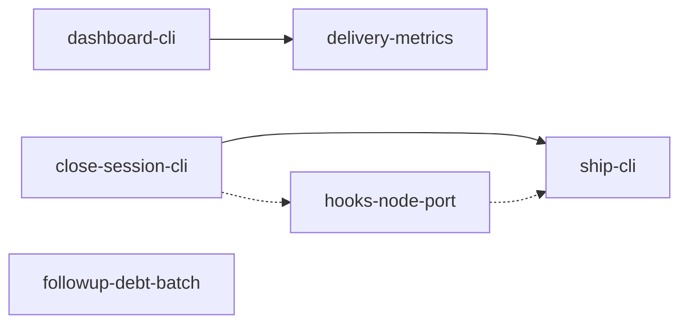

```yaml
initiative: agento-hardening
created: 2026-10-09
last-updated: 2026-10-09
```

# Agento hardening: one-spawn dashboard, CLI-driven ship and close, single-source hooks, delivery metrics

## Goal

Agento gets faster, more reliable at the end of a delivery, cheaper to maintain, and
more transparent about where delivery time goes. After this initiative:

- A dashboard refresh is one `agento.mjs dashboard` spawn instead of 4 + N.
- `/agento close-session` and `/agento ship` are thin formatters over one resumable
  CLI call each.
- The two hooks run one Node implementation instead of duplicated Python.
- The follow-ups recorded across past deliveries are closed.
- Every delivery shows a timeline derived from git and roadmap history.

No CLI field, exit code, lifecycle rule, or command boundary changes. Everything is
additive.

## Decisions

Clarifying questions were asked with the ask-questions tool. Every answer was the
option marked recommended.

- **Q: Should ship-cli and close-session-cli be separate member features or one?**
  A: Separate members (recommended): close-session-cli (S/M) can ship first, and
  ship-cli (L) reuses its teardown.
- **Q: How should the two hooks share one implementation?** A: Node port behind
  the shell wrappers (recommended). It lives beside `agento.mjs`, drops the
  python3 dependency, and leaves the fixtures unchanged.
- **Q: What must land in wave 1?** A: Dashboard CLI + follow-up debt batch
  (recommended): the biggest performance win plus quick fixes, both independent.
- **Q: How far should delivery metrics go in this initiative?** A: CLI metrics +
  dashboard Timeline row (recommended). This is what the brief asks for, and it
  depends on the dashboard member.
- **Q: Which follow-ups belong to the debt batch vs their thematic member?**
  A: Thematic ones move to their member (recommended):
  - the gh probe and the memoised primary root go to the dashboard member;
  - the nudge, `PROTECTED`, and refspec fixes go to the hooks member;
  - the batch keeps `paths`, the instructions, `gh pr edit`, the models vendor
    warning, and handoffs model.

## Research

Skills consulted: none — no matching domain. The repository has no `.agents/skills/`
directory and no skills table in AGENTS.md (verified 2026-10-09).

### Dashboard refresh cost (measured 2026-10-09 on `main` `4b38ce5`)

- **Seven spawns per refresh.** `extension/src/extension.ts` (refresh at ~L201–260)
  runs `session --pr`, `doctor --plugin-root`, and `status --pr` in parallel, and
  separately `initiative` plus `initiative <slug>` for each of the 3 initiatives.
- **Every spawn repeats the bootstrap.** Each one runs the module-level bootstrap in
  `scripts/agento.mjs` (2 237 lines): `anchorRoot()` (a readdir of the primary's
  parent plus a config parse per sibling checkout), `resolveArtifacts()`, and
  several `git worktree list --porcelain` calls (`primaryWorktreesDir()` is
  re-derived at L576, L630, L719, L731, L1675, L1909).
- **Measured wall time per call:**

  | Call | Time |
  | --- | --- |
  | `session --pr` | 979 ms |
  | `doctor` | 1 286 ms |
  | `status --pr` | 1 465 ms |
  | `initiative` | 92 ms |
  | `initiative <slug>` | 86 ms |

  That is about 3.9 s of CPU-bound process time per refresh. The parallel critical
  path is about 1.5 s, and the refresh debounce is at least 3 000 ms.
- **PR lookups are serial and synchronous.** `lookupPullRequest()` (L593) runs
  `execFileSync("gh", ["--version"])` and then `gh pr view` once per call, and
  `lookupCompanionPullRequest()` (L612) repeats it in the companion clone. `status
  --pr` loops over non-complete items serially. `doctor` (L699) probes `gh` again.
- **Recorded follow-ups this member absorbs:**
  - one shared `gh --version` probe (`ship-dual-merge` and `mirrored-artifact-branches`
    roadmaps);
  - memoise the primary-root and worktree-list lookup (`artifact-repo-config`
    review).

### Ship and close procedures

- **The prompts are still long prose procedures.**
  `.github/prompts/ship.prompt.md` is 327 lines: ownership, dual audit, the
  hard-reject and confirmation gap lists, the changelog stamp, the dual
  ready/merge, the release wait, the dual sync, teardown, and the post-ship
  epilogue. `.github/prompts/close-session.prompt.md` is 134 lines.
- **Their deterministic inputs already exist in the CLI:**
  - `ship-preflight --pr` (`owner`, `ownerTree`, `companion`, `companionTree`,
    `companionGaps`, `pr`, `companionPr`);
  - `close-decision` (`owner`, `reason`, `companion`);
  - `release <merge-sha> --wait N`;
  - `scripts/wait-for-checks.sh`.
- **Precedent: `start-session-cli` (2026-10).** Collapsing the 160-line
  start-session prompt into one `agento.mjs start-session` call took the prompt to
  93 lines. Its JSON (`status`/`reason`/`allowed`/`elsewhere`/`preflight`/`next`)
  maps onto §9, §10, and §12, and the extension calls it directly. A real run took
  0.97 s.
- **Incidents that came from the prose:**
  - #47: guard branch delete on main;
  - #88: untracked byproducts and the `--literal-pathspecs` clean;
  - the superseded release runs that `deterministic-release-wait` addressed;
  - the gh 2.45 `gh pr edit --body` failure.
- **A CLI-side worktree removal bypasses the guard's occupant check.** That check
  (`delivery-guard.sh`, the `code --status` scan for `Folder (…)` / `Workspace (…)`
  windows and processes under the target) gates `git worktree remove`. When a CLI
  subcommand removes worktrees itself, the guard only sees `node agento.mjs …`, so
  the CLI must run the same check.

### Hooks

- **Two shell wrappers around large Python heredocs.**
  `scripts/hooks/delivery-guard.sh` (454 lines) and
  `scripts/hooks/session-context.sh` (189 lines) wrap Python heredocs. The
  `resolve_artifacts()` region (`# --- shared with … ---`, L252) is duplicated
  byte-for-byte by convention.
- **The wiring has two entry points.** `hooks/hooks.json` (plugin mode,
  `${CLAUDE_PLUGIN_ROOT}/scripts/hooks/*.sh`) and `.github/hooks/` (workspace mode)
  call those two `.sh` files. Keeping the wrappers keeps both wirings and
  `replay-guard.sh` unchanged.
- **`PROTECTED` (L123) misses the wiring files.** It matches only
  `.github/hooks/|scripts/hooks/`; `hooks/hooks.json` and `.claude-plugin/` are
  unprotected (`plugin-hooks-layout` follow-up).
- **Recorded guard gaps:**
  - the roadmap nudge inspects the companion clone's index and `HEAD`, not the
    session's companion half (`artifact-history-migration` follow-up);
  - an explicit-refspec content push of a non-default branch while on the default
    branch is denied (`guard-branch-delete-on-main` follow-up).

### Follow-up debt (unfiled, from shipped roadmaps and reviews)

- `agento.mjs paths` resolves `worktreesDir` against the current checkout rather
  than the primary (`cli-dashboard-json` follow-up).
- `concurrent-delivery.instructions.md` (`applyTo: features/**,issues/**`) does not
  load for artifact edits in the companion folder (`artifact-history-migration`
  follow-up).
- `gh pr edit --body` fails on gh 2.45.0 (Projects-classic GraphQL deprecation).
  The `gh api -X PATCH repos/<o>/<r>/pulls/<n> -f body=…` fallback is undocumented
  in the prompts (`artifact-history-migration` follow-up).
- `models show` / `doctor` do not warn about values without a `(vendor)` suffix
  (`model-profiles` follow-up).
- Whether a mid-conversation handoff honours the target agent's `model:` pin is
  unverified (`model-profiles` 4.7 follow-up).

### Delivery metrics sources

Everything needed is in git, with no new state:

- roadmap `status:` header transitions in `git log -p -- <dir>/roadmap.md`, in the
  artifact checkout (the companion in companion mode);
- `review.md` verdict commits (review rounds = `request-changes` verdicts);
- `paused` intervals;
- the code PR merge commit (`git log --merges` on the default branch);
- `(manual, post-ship)` tick dates.

## Features

### dashboard-cli

- Summary: `agento.mjs dashboard [--pr]` returns session, doctor, status, and every initiative from one process, and the extension refreshes with one spawn.
- Brief: "A single `agento.mjs dashboard [--pr]` subcommand returning session, doctor, status, and every initiative in one JSON document from one process, with worktree lists and the primary root computed once, the `gh` probe run once, and PR lookups executed concurrently; the extension refreshes with one spawn and keeps today's models and views unchanged." It also absorbs the shared `gh` probe and memoised primary-root follow-ups.
- Requires: none
- Recommended after: none
- Wave: 1
- Size: M
- Independence: It is a new additive subcommand plus an extension refresh switch, and every existing subcommand keeps its output. The extension's tree models already parse each sub-document, so the views render the same data from one snapshot.

### followup-debt-batch

- Summary: Close the unfiled non-thematic follow-ups, each with a test or recorded evidence.
- Brief: "A follow-up debt batch closing the unfiled items above, each with a test." The items are `agento.mjs paths` resolving `worktrees.dir` against the current checkout, `concurrent-delivery.instructions.md` not loading in the companion folder, the `gh pr edit --body` failure on gh 2.45, no vendor-suffix warning in `models show`, and unverified `handoffs[].model`.
- Requires: none
- Recommended after: none
- Wave: 1
- Size: S
- Independence: Five small, unrelated fixes in `paths`, the init templates, prompt wording, `models`, and one verification. None touches the dashboard, ship, close, or hook code paths.

### close-session-cli

- Summary: `agento.mjs close-session` performs the plan, freehand, and abandoned-build close as one resumable CLI call, and the prompt becomes a formatter.
- Brief: "`agento.mjs close-session` likewise." Like the ship state machine, it is an idempotent, resumable close that reuses `close-decision` and leaves the prompt a formatter the way `start-session` was.
- Requires: none
- Recommended after: none
- Wave: 2
- Size: M
- Independence: It reuses `close-decision` and the session record, and ships its own Node occupant check (VS Code window and process cwd) because a CLI-side `git worktree remove` is invisible to the guard. Ship's teardown keeps working through the prose prompt until `ship-cli` lands.

### hooks-node-port

- Summary: Port both hooks' Python to one Node module behind the unchanged shell wrappers, and fix the recorded guard gaps with fixtures.
- Brief: "One source of truth for the hook logic … with the replay harness and fixtures unchanged, `PROTECTED` extended to `hooks.json` and `.claude-plugin`, the nudge re-targeted to the session's companion half, and the explicit-refspec false positive fixed with fixtures."
- Requires: none
- Recommended after: close-session-cli
- Wave: 2
- Size: L
- Independence: The wrappers, both hook wirings, and every existing fixture verdict stay as they are, so the port is behaviour-preserving apart from the three named fixes, each exposed by a new fixture. Landing after `close-session-cli` lets the guard reuse that member's Node occupant check instead of porting a second copy.

### delivery-metrics

- Summary: `agento.mjs metrics [<slug>]` derives cycle time per phase, review rounds, pause durations, and post-ship latency from git and roadmap history, and the dashboard shows a Timeline row per delivery.
- Brief: "Derived delivery metrics (`agento.mjs metrics`): cycle time per phase, review rounds, pause durations, and post-ship latency computed from git and roadmap history only, shown as a Timeline row per delivery in the dashboard."
- Requires: dashboard-cli
- Recommended after: none
- Wave: 2
- Size: M
- Independence: The read-only subcommand adds no state. The Timeline row is one additive field in the `dashboard` document and one tree child per delivery, so nothing else changes.

### ship-cli

- Summary: `agento.mjs ship <type> <slug>` runs the audit → ready → code merge → companion merge → release wait → sync → teardown → epilogue state machine, resuming from git state, and the ship prompt becomes a formatter.
- Brief: "`agento.mjs ship <type> <slug>` as an idempotent, resumable state machine (audit → ready/merge code PR → merge companion PR → sync defaults → teardown → epilogue), with the prompt reduced to a formatter the way `start-session` was … Existing `ship-preflight`, `close-decision`, `release`, and `wait-for-checks.sh` are reused, not reimplemented. The user's `/agento ship` remains the only path that marks PRs ready or merges."
- Requires: close-session-cli
- Recommended after: hooks-node-port
- Wave: 3
- Size: L
- Independence: The phases already exist as CLI facts (`ship-preflight --pr`, `release`) plus prose. This member moves the decisions into code and reuses `close-session-cli`'s teardown and occupant check. Every §9 idempotency case stays as specified (resume at teardown, resume at companion merge, epilogue on `complete`).

## Recommended order

- **Wave 1 — dashboard-cli, followup-debt-batch.** These are the biggest
  user-visible performance win plus the cheap fixes. They are independent of each
  other and of everything else, so two sessions can run them concurrently.
  `dashboard-cli` is listed first and is the CLI's `next`.
- **Wave 2 — close-session-cli, hooks-node-port, delivery-metrics.**
  - `close-session-cli` establishes the CLI teardown and the Node occupant check.
  - `hooks-node-port` follows it so the guard reuses that check (soft ordering
    only; it can start in parallel if the check is extracted first).
  - `delivery-metrics` needs the `dashboard` document to carry its Timeline field.
- **Wave 3 — ship-cli.** It is the largest member and the one where a regression
  costs most. It builds on `close-session-cli`'s teardown and lands after the hooks
  port so the guard behaviour it relies on is final.



## Risks

- **A CLI-side worktree removal bypasses the guard's occupant scan.** The guard
  only sees `node agento.mjs close-session|ship`. *Mitigation:* `close-session-cli`
  implements the occupant check in Node. While a window or process holds a half, it
  returns a pause result naming it and removes nothing. `ship-cli` reuses it.
  `hooks-node-port` makes the guard call the same function.
- **Agents other than `/agento ship` could invoke `agento.mjs ship` and merge.**
  *Mitigations:*
  - `ship-cli`'s plan adds a customizations test that only the ship prompt and its
    mirror reference `agento.mjs ship`;
  - merges require an explicit `--confirm <token>` echoed from the audit result,
    which the user grants in the ship prompt;
  - policy §7 keeps "only the user's `/agento ship` marks ready or merges".
- **Ship's confirmation gaps need a human answer mid-command.** These are
  untracked byproducts, a missing `Fixes #n`, and the changelog stamp.
  *Mitigation:* the CLI returns `needs-confirmation` with the listed items and a
  token, and a second call with `--confirm` proceeds. Every phase resumes from git
  and PR state, the same way `start-session` returns `rejected` without writing.
- **The hook port changes a security-sensitive surface.** *Mitigations:*
  - every existing fixture in both replay files must keep its verdict before any
    fix lands;
  - the three fixes are exposed by new failing fixtures first;
  - hook edits stay approval-gated, and the port keeps few, large edits.
- **The hook port changes fail behaviour when Node is missing.** Today the Python
  path does not need Node. *Mitigation:* the wrapper checks for `node` once. When
  it is missing, the guard returns `ask` (fail closed) naming the fix, and
  SessionStart prints today's minimal branch line. `hooks-node-port`'s plan records
  that decision.
- **The dashboard document becomes a second contract next to the per-subcommand
  documents.** *Mitigation:* `dashboard` embeds the exact `session`, `doctor`,
  `status`, and `initiative` objects, so the extension's existing parsers validate
  them unchanged. A CLI test asserts each embedded object deep-equals the
  standalone subcommand's output on the same fixture.
- **Concurrent PR lookups can hit GitHub rate limits or leave stray processes.**
  *Mitigation:* use a bounded concurrency pool (e.g. 4), keep the existing 15 s
  per-call timeout, and degrade per item to `pr: null` plus a warning, as today.
- **Concurrent wave-1 sessions can conflict in shared files.** Both edit
  `CHANGELOG.md`, `docs/commands.md`, and `extension/cli/` (copied).
  *Mitigation:* integrate `origin/main` by merge before every push, and regenerate
  `extension/cli/` with `npm run copy-cli` rather than hand-resolving it.

## Out of scope

- Observing or cancelling chat in other windows, Windows support, non-GitHub
  remotes, Marketplace publishing automation, and multi-repo dashboards (from the
  brief).
- Guard follow-ups the brief does not name: the fully qualified `refs/heads/<default>`
  delete spelling, the `main-thing` token match, and mixed refspec lists. They are
  candidates for `/agento triage-followups`.
- Removing the per-subcommand calls the dashboard replaces. Prompts and other
  consumers keep using `session`, `status`, `doctor`, and `initiative`.
- New lifecycle states, new commands beyond the CLI subcommands named here, and any
  change to the §8 window boundaries.

## Definition of done

- A dashboard refresh on this repository is one CLI spawn, and its measured wall
  time is lower than the 2026-10-09 baseline above (critical path about 1.5 s,
  about 3.9 s total process time across 7 spawns).
- Each of `/agento close-session` and `/agento ship` resolves to one CLI call per
  phase.
- A re-sent command resumes from git and PR state, including resume at teardown,
  resume at the companion merge, and the post-ship epilogue.
- Both hooks run one Node implementation behind the unchanged wrappers, every
  pre-existing fixture keeps its verdict, and the three named gaps have passing
  fixtures.
- Every follow-up listed in `## Research` is closed by a member or filed as an
  issue.
- The dashboard shows a Timeline row per delivery, backed by `agento.mjs metrics`.
- Every member's full gate is green: node tests, both replay-guard runs,
  shellcheck, extension unit and Electron tests, and the bundle test.
